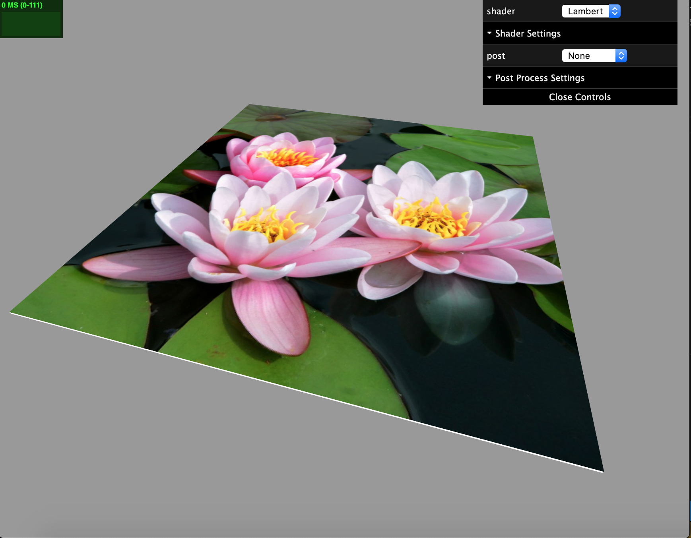
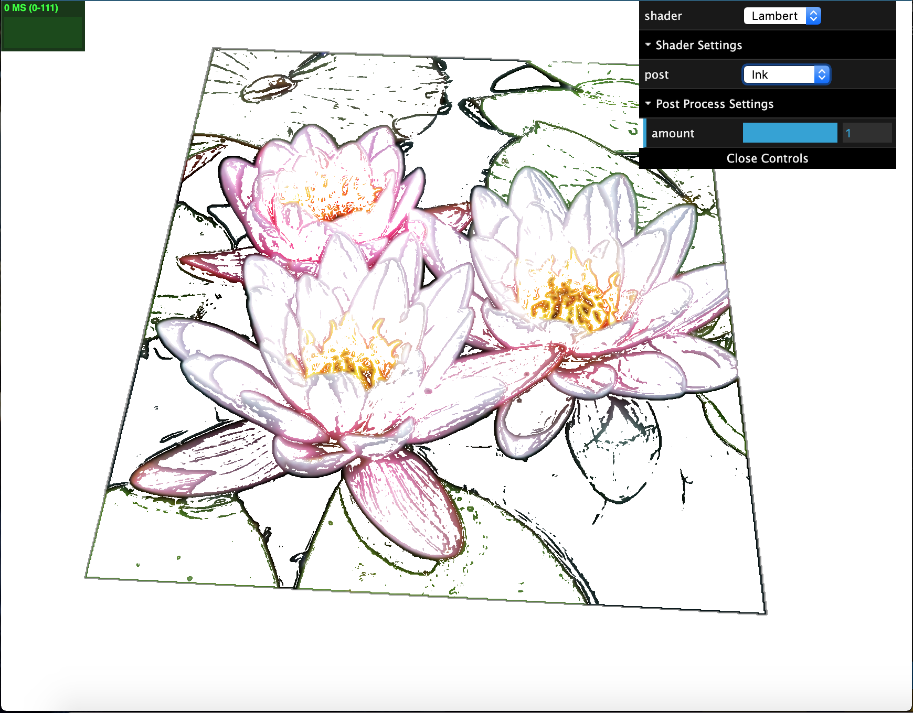
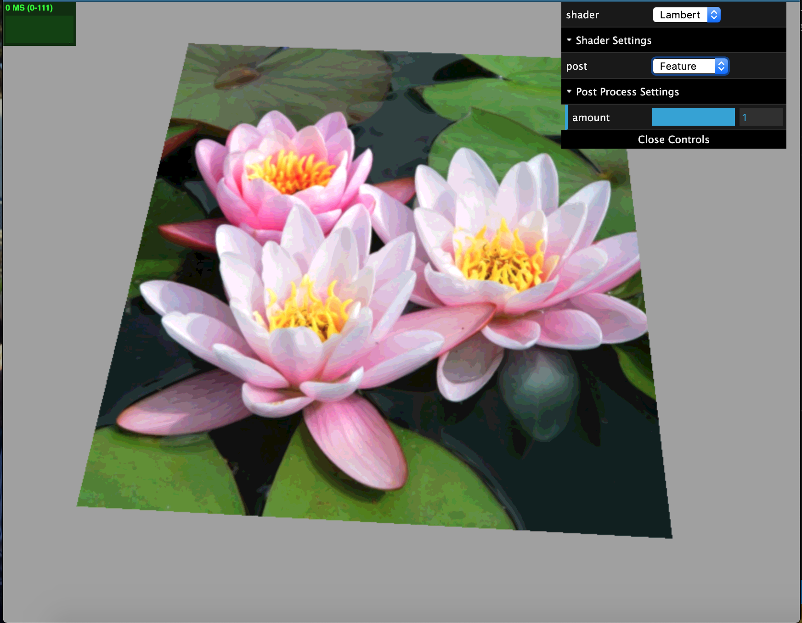
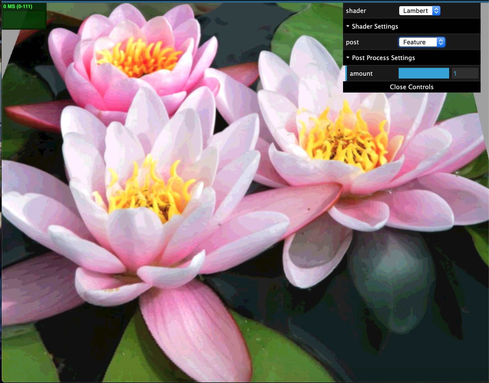

# Final Project
## PennKey: catyang
### (catyang97.github.io/566-final-project/)
- I'm really sorry, but I couldn't get the deploying to work. I tried using the steps that I used for the previous homeworks but keep getting this error message: bundle.js:1 Failed to load resource: the server responded with a status of 404 (). I also tried the npm run deploy method and the suggestion on piazza, but those both gave the same error.

---
## Resources
- Base code from CIS700's shader assignment: https://cis700-procedural-graphics.github.io/assignments/proj5-shaders/
- Image-Based Color Ink Diffusion Rendering (paper inspiration): https://ieeexplore.ieee.org/abstract/document/4069233
- Sobel filtering: https://en.wikipedia.org/wiki/Sobel_
operator

---
## Milestone Progress
- Apply image as texture to an object (painting)
- Set up EffectComposer, ShaderPass, RenderPass for the ink shaders
- Sobel filtering to find/emphasize edge data
- Getting more familiar with three js
- Started setting up noise for paper texture

### Shaders (work in progress)
- *ink*: currently uses sobel filtering to find the edges and only colors the edges. This is part of step 1 of the algorithm in the paper, "feature extraction", to find the main characteristics.
- *feature*: partitions the image into chunkier regions of similar color. Also part of step 1 and called color segmentation. (amount adjustable)
- *paper*: using noise to simulate paper texture. (doesn't work yet, see next steps)
- (Paper is in the shader section of the gui while ink and feature are in post.)

---
## Next Steps
- Combine shaders. Right now, I have different steps of the algorithms separated.
- Finish implementing the ink diffusion algorithm.
- Figure out how to change the rectangle so that it takes the shader material info while also wrapping the image material around the obj correctly. 
- Add more non-photorealistic effect options to the images
- Friendlier UI and add ability to input image

---
## Images
Original

Ink Shader: Sobel + Edge Coloring

Feature Shader

Close Up

