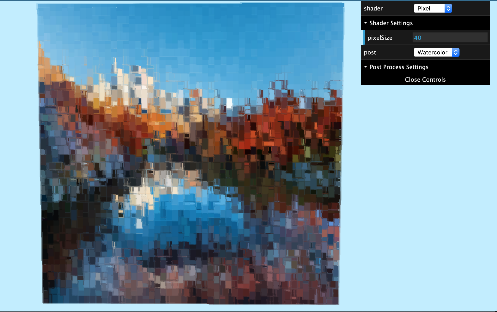

# Final Project
## PennKey: catyang
### catyang97.github.io/566-final-project/ 

---
## The ~ Project ~

The inspiration for the project came from a paper titled *Image-Based Color Ink Diffusion Rendering* which describes a method for simulating how ink mixes and diffuses on paper. However, there were a couple parts of the algorithm/pipeline that were not very feasible to implement. SO, instead I took pieces of the paper and mainly implemented my own shaders with three.js for different non-photorealistic techniques, using Project 5 from CIS700 as the base code.

I made a rectangular obj for the canvas and the bmp images are loaded as textures for the image that we are manipulating. The shaders in the shader folder use the material from the obj texture. The post-processing shaders are each set up with a EffectComposer, ShaderPass, and RenderPass. (The image right now is from the mountain.bmp file but any bmp file can be loaded by editing the rectangle.js file.)

---
## Shaders!

From the shader dropdown
- *LAMBERT*: from the base code
- *PAPER*: adds noise to the texture to simulate water color paper texture
- *PIXEL*: pixelizes the image and moves/blinks with time

From the post(processing) dropdown
- *INK*: uses sobel filtering to color edges black and add inky shading around the edges
- *FEATURE*: separates the image into bigger blocks of similar colors
- *WATERCOLOR*: uses sobel to find edges and then 'bleeds color' by mixing with the colors around the edges. best when combined with the *paper* shader
- *WARP*: warps the image with fbm functions from shadertoy

---
## Resources
- Base code from CIS700's shader assignment: https://cis700-procedural-graphics.github.io/assignments/proj5-shaders/
- Image-Based Color Ink Diffusion Rendering (paper inspiration): https://ieeexplore.ieee.org/abstract/document/4069233
- Sobel filtering: https://en.wikipedia.org/wiki/Sobel_
operator
- CIS700 Color Slides: https://cis700-procedural-graphics.github.io/files/color_2_14_17.pdf
- Noise functions (in shaders' comments) from Shadertoy

---
## Images!!

### Pixel

### Ink

### Watercolor

### Feature

## Warp

### Original Images for Reference
 